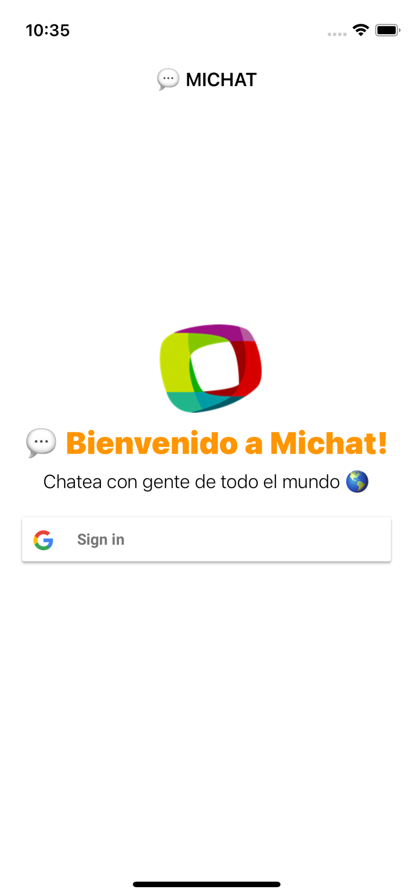
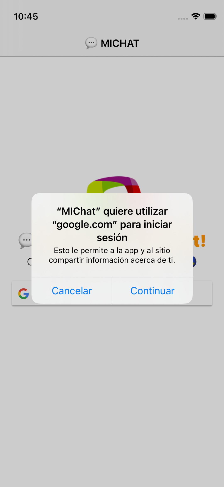
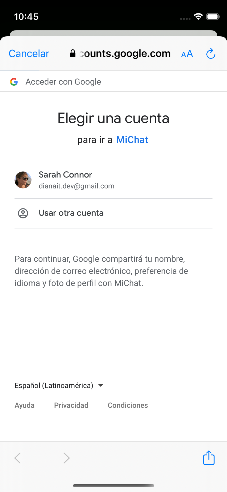
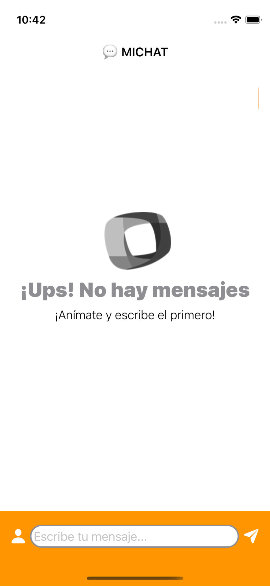
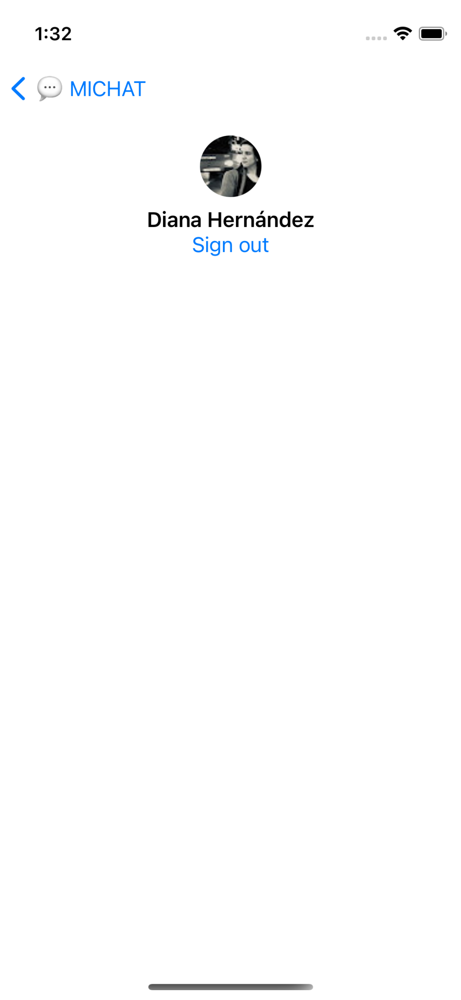

# FIREBASE CHAT 👉 MIChat 💬
### 📱 Crea una aplicación de chat usando Firebase como tu backend 
####  💪  &nbsp; Reto mensual creado por [MoureDev](https://github.com/mouredev/Monthly-App-Challenge-2022) y [Rviewer](https://go.rviewer.io/dev-firebase-chat-es)

---

## 👩‍💻 Tecnologías
- iOS con SwiftUI 
- Firestore database
- Firebase Authentication

## 📹 Video

- <a href="https://player.vimeo.com/video/740348020?h=24826d6c2f"> 👀  &nbsp;Ver video demostración</a>

- ⬇️  &nbsp;Si no puedes ver el video lop puedes descagar aquí  <a href="https://github.com/Rviewer-Challenges/fS8lnk24GHJIXulBagvw/blob/devel/images/MIChat.mp4?raw=true" download>Descargar video demostración</a>

## 📸 Capturas de pantalla
<table>
    <tr>
        <td>
        Login View
        </td>
        <td colspan="2">
        Sign in con Google
        </td>
        </tr>
    <tr>
        <td>
        
        </td>
            <td>
        
        </td>
        <td>
        
        </td>
    </tr>
</table>
<table>
    <tr>
        <td>
        Empty state View
        </td>
        <td>
        Chats View
        </td>
        <td>
        Profile View
        </td>
    </tr>
    <tr>
        <td>
        
        </td>
        <td>
        
        </td>
        <td>
        
        </td>
    </tr>
</table>

## 📱 A nivel general
- [x] Login con tu cuenta de Google.
- [x] Una vez realizado, accederás a una sala de chat donde se visualizarán los mensajes de todos los usuarios

## 🚪 Pantalla de acceso

- [x] Seleccionar tu cuenta de Google para acceder a la App
- [x] En algún lugar de la aplicación debe existir la posibilidad de hacer logout.

## 💬 Sala de Chat

- [x] Este chat será en tiempo real y las conversaciones se guardarán
- [x] cada vez que regreses a la sala de chat podrás consultar los mensajes anteriores.
- [x] tus respuestas irán alineadas a la derecha y las de los otros usuarios a la izquierda.
- [x] Únicamente tienes que representar texto y el nombre del usuario que lo envió 

## 🎖️ EXTRA!

- [x] Hora del mensaje
- [x] Empty state

