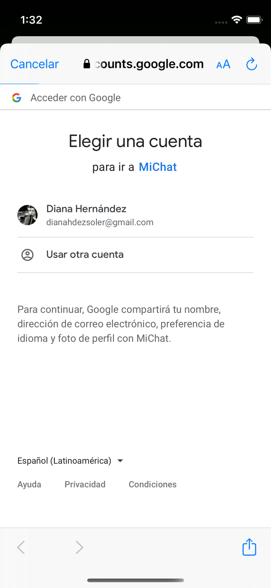
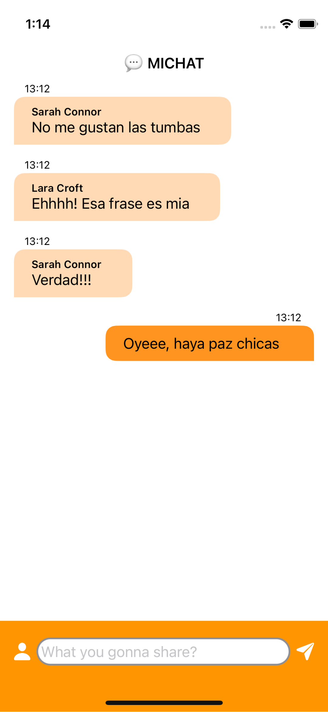

# FIREBASE CHAT 👉 MIChat 💬
### 📱 Crea una aplicación de chat usando Firebase como tu backend.
####  💪    Reto mensual creado por [MoureDev](https://github.com/mouredev/Monthly-App-Challenge-2022) y [Rviewer](https://rviewer.io/)

---

    

## 👩‍💻 Tecnologías
- iOS 
- SwiftUI 
- Firestore database
- Firebase Authentication

## 📱 A nivel general
- [x] Login con tu cuenta de Google.
- [x] Una vez realizado, accederás a una sala de chat donde se visualizarán los mensajes de todos los usuarios

## 🚪 Pantalla de acceso

- [x] Seleccionar tu cuenta de Google para acceder a la App
- [x] En algún lugar de la aplicación debe existir la posibilidad de hacer logout.

## 💬 Sala de Chat

- [x] Este chat será en tiempo real y las conversaciones se guardarán
- [x] cada vez que regreses a la sala de chat podrás consultar los mensajes anteriores.
- [x] tus respuestas irán alineadas a la derecha y las de los otros usuarios a la izquierda.
- [x] Únicamente tienes que representar texto y el nombre del usuario que lo envió 

## 🎖️ EXTRA!

- [x] Hora del mensaje
- [x] Empty state

## 📸 Capturas de pantalla
<table>
    <tr>
        <td>
        Login View
        </td>
        <td colspan="2">
        Sign in con Google
        </td>
        </tr>
    <tr>
        <td>
        
        </td>
            <td>
        
        </td>
        <td>
        
        </td>
    </tr>
</table>
<table>
    <tr>
        <td>
        Empty state View
        </td>
        <td>
        Chats View
        </td>
        <td>
        Profile View
        </td>
    </tr>
    <tr>
        <td>
        
        </td>
        <td>
        
        </td>
        <td>
        
        </td>
    </tr>
</table>

## 📹 Video

<iframe src="https://player.vimeo.com/video/740338865?h=17ed4d5ab2" width="640" height="564" frameborder="0" allow="autoplay; fullscreen" allowfullscreen></iframe>

Si no puedes ver el video lop puedes descagar <a href="./images/MIChat.mov" download>Descargar video demostración</a>

